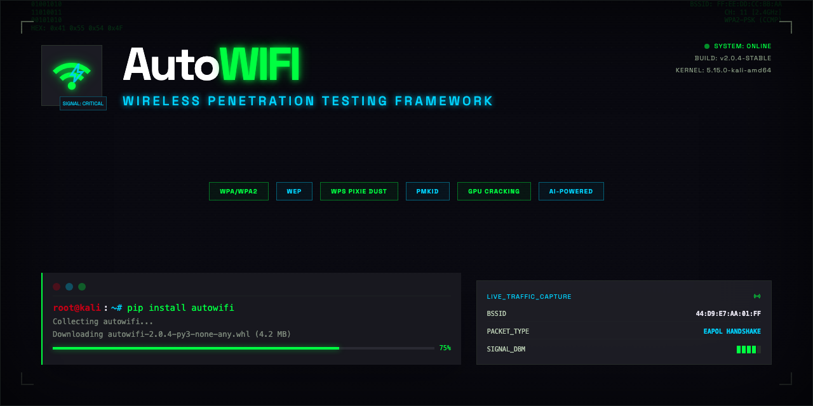

<p align="center">
  
</p>

<p align="center">
  <strong>Wireless penetration testing framework.</strong><br>
  Automates the full attack chain - recon through exploitation - with a clean terminal interface.
</p>

<p align="center">
  <a href="https://pypi.org/project/autowifi/"></a>
  <a href="https://pypi.org/project/autowifi/"></a>
  <a href="https://github.com/momenbasel/AutoWIFI/blob/main/LICENSE"></a>
  <a href="https://github.com/momenbasel/AutoWIFI/stargazers"></a>
</p>

## Features

- **Multi-vector attacks** - WEP (ARP replay, fragmentation, chopchop), WPA/WPA2 (handshake capture, PMKID), WPS (pixie dust, PIN brute force)
- **Smart target selection** - Auto-recommends attack vectors based on target encryption and configuration
- **Live scanning** - Real-time network discovery with signal strength visualization and client tracking
- **Multiple cracking backends** - aircrack-ng, hashcat (GPU), John the Ripper
- **Session management** - Save, restore, and resume interrupted operations
- **Report generation** - Export findings in HTML, JSON, and text formats
- **Interface management** - Automatic monitor mode, MAC randomization, channel control
- **Handshake verification** - Multi-method validation of captured handshakes
- **Wordlist discovery** - Auto-detects installed wordlists (rockyou, seclists, etc.)

## Requirements

- Linux with a wireless adapter that supports monitor mode
- Python 3.9+
- aircrack-ng suite (required)
- Optional: hashcat, reaver, bully, hcxdumptool, mdk4, macchanger

## Installation

### From PyPI (recommended)

```bash
pip install autowifi
```

### Install system dependencies

The framework wraps the aircrack-ng suite and related tools. Install them for your distro:

**Debian / Ubuntu / Kali:**
```bash
sudo apt update
sudo apt install -y aircrack-ng reaver bully hcxdumptool hcxtools hashcat macchanger mdk4 tshark
```

**Arch Linux:**
```bash
sudo pacman -S aircrack-ng reaver hashcat hcxdumptool hcxtools macchanger wireshark-cli
```

**Fedora:**
```bash
sudo dnf install aircrack-ng reaver hashcat hcxdumptool hcxtools macchanger wireshark-cli
```

Only `aircrack-ng` is strictly required. The rest unlock additional attack vectors (WPS, PMKID, GPU cracking, etc.).

### From source

```bash
git clone https://github.com/momenbasel/AutoWIFI.git
cd AutoWIFI
pip install .
```

### Development

```bash
git clone https://github.com/momenbasel/AutoWIFI.git
cd AutoWIFI
pip install -e .
```

### Verify installation

```bash
sudo autowifi --version
```

## Usage

### Interactive mode

```bash
sudo autowifi
```

Launches the full TUI with menu-driven workflow - scan, select target, attack, crack.

### CLI mode

Scan networks:
```bash
sudo autowifi scan -i wlan0mon -d 30
```

Capture WPA handshake:
```bash
sudo autowifi capture -i wlan0mon -b AA:BB:CC:DD:EE:FF -c 6 -t 120
```

Crack a capture file:
```bash
sudo autowifi crack handshake.cap -w /usr/share/wordlists/rockyou.txt
```

Use hashcat backend:
```bash
sudo autowifi crack handshake.cap -w rockyou.txt --backend hashcat
```

## Attack Vectors

| Attack | Encryption | Method |
|--------|-----------|--------|
| ARP Replay | WEP | IV collection via ARP request replay |
| Fragmentation | WEP | Keystream recovery through fragmented packets |
| ChopChop | WEP | KoreK chopchop keystream extraction |
| Handshake Capture | WPA/WPA2 | Deauth + 4-way handshake capture |
| PMKID | WPA/WPA2 | Clientless key extraction from first EAPOL frame |
| Pixie Dust | WPS | Offline WPS PIN recovery via Raghav Bisht / Dominique Bongard |
| PIN Brute Force | WPS | Online WPS PIN enumeration |

## Configuration

Settings are stored in `~/.autowifi/config.json`. Edit through the interactive menu or directly:

```json
{
  "interface": "wlan0",
  "scan_duration": 30,
  "deauth_count": 15,
  "handshake_timeout": 180,
  "default_wordlist": "/usr/share/wordlists/rockyou.txt",
  "crack_backend": "aircrack",
  "mac_randomize": false,
  "auto_crack": true
}
```

## Project Structure

```
autowifi/
  cli.py          - Entry point, interactive mode, CLI commands
  ui.py           - Terminal UI components (Rich-based)
  scanner.py      - Network discovery and client tracking
  attacks.py      - WEP, WPA, WPS, PMKID attack implementations
  handshake.py    - Handshake capture and verification
  cracker.py      - Multi-backend password cracking
  interface.py    - Wireless interface management
  session.py      - Session persistence
  report.py       - HTML/JSON/text report generation
  config.py       - Configuration management
  deps.py         - Dependency checking
```

## Legal

This tool is intended for authorized security testing and educational purposes only. Unauthorized access to computer networks is illegal. Always obtain proper written authorization before testing.

## License

GPL-3.0
